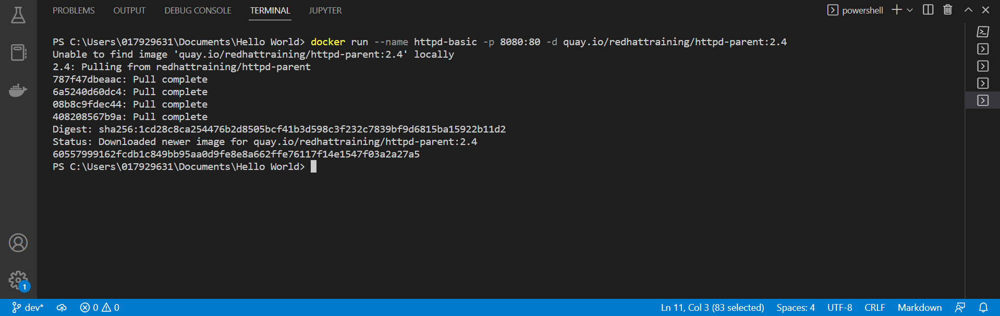
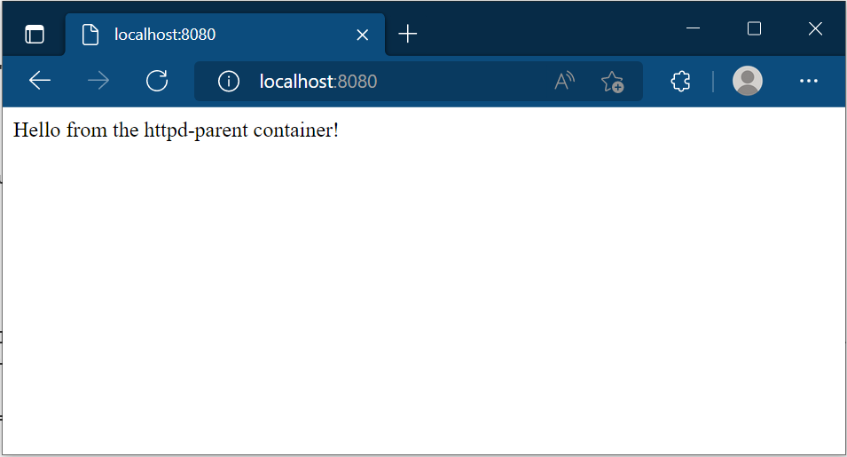
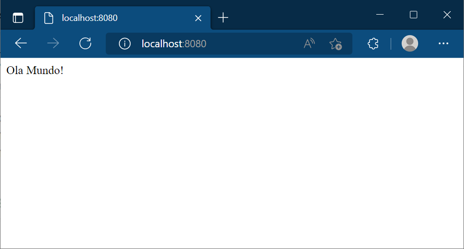
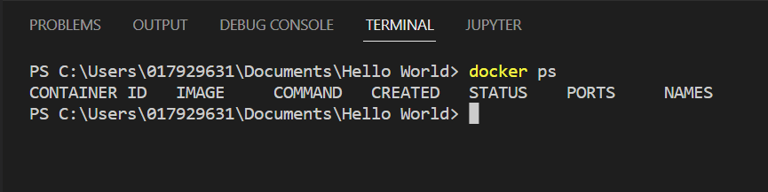

# Exercicios

### 1 Execute um container baseado nas informações abaixo:
* Baixe a imagem quay.io/redhattraining/httpd-parent;
* Use a tag 2.4 da imagem;
* O nome do container deve chamar httpd-basic;
* O container deve ser executado em background;
* O serviço deve ser disponivel na porta 8080 e redirecionar para a porta 80 do container.

```
# docker run --name httpd-basic -p 8080:80 -d quay.io/redhattraining/httpd-parent:2.4
```



Para ter certeza que o container esta executando verifique atraves de linha de comando e depois atraves do seu navegador utilizando o endereço http://localhost:8080. Deve aparecer a mensage "Hello from the httpd-parent container!"



**Obs**
Conforme vimos, o docker hub não é o único repositório de imagens, existem outros, alguns públicos e outros privados. No seu dia a dia você encontrará as informações necessárias para utilizar a imagem correta. Neste exemplo estamos utilizando o quay.io para baixar a imagem httpd-parent utilizando a tag 2.4.
</br>

### 2 Customize a mensagem apresentada em seu navegador quando é acessado o endereço http://localhost:8080.

* Acesse o seu container que esta sendo executado;

```
# docker exec -it httpd-basic /bin/bash
```

* Dentro do container acessar o endereço /var/www/html e verifique se dentro desta pasta existe um arquivo index.html;

```
# cd var
# cd www
# cd html
# vi index.html
```

* Ainda dentro do container, subistitua a mensagem atual por uma nova "Ola mundo!" que esta no arquivo index.html.

escrever a nova mensagem
```
press esc
:w (to save)
:q (to leave)
```

* Saia do container e verifique se a nova mensagem foi inserida.

```
exit
```



</br>

### 3 Pare o container que esta sendo executado.

```
docker stop httpd-basic
```

