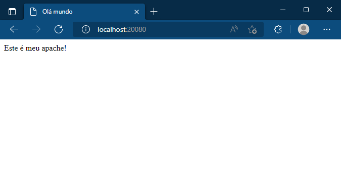
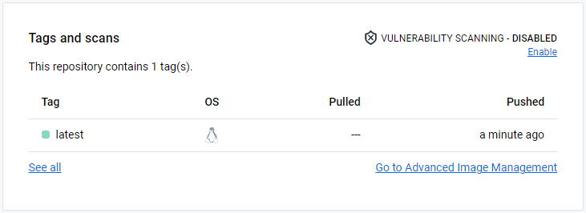

# Exercicios

### 1 Crie uma imagem utilizando o _Dockerfile_ baseado nos parâmetros abaixo:
* A imagem de base é redhat/ubi8:8.5;
* Define o nome do autor desejado e o ID de e-mail com a instrução MAINTAINER(deprecated. using `LABEL` instead);
* Define a variável de ambiente PORT para 8080;
* Instale o Apache (pacote httpd);
* Altere o arquivo de configuração do Apache /etc/httpd/conf/httpd.conf para ouvir a porta 8080 em vez da porta 80 padrão;
* Altere a propriedade das pastas /etc/httpd/logs e /run/httpd para o usuário e grupo apache (UID e GID são 48);

```
sed -ri -e "/^Listen 80/c\Listen ${PORT}" /etc/httpd/conf/httpd.conf && \
    chown -R apache:apache /etc/httpd/logs/ && \
    chown -R apache:apache /run/httpd/
```

* Exponha o valor definido na variável de ambiente PORT para que os usuários do contêiner saibam como acessar o Apache Web Server;
* Crie uma pasta chamada src, e depois crie uma arquivo index.html. O conteúdo da pasta src/ deve ser copiado para o arquivo Apache DocumentRoot (/var/www/html/) dentro do container;
  
_index.html_
```
<html>
 <header><title>Olá mundo</title></header>
 <body>
   Este é meu apache! 
 </body>
</html>
```

* A pasta src deve conter apenas o arquivo index.html criado no passo anterior que imprime uma mensagem "Este é meu apache!";

* Inicie o daemon Apache httpd em primeiro plano usando a instrução CMD e o seguinte comando:

```
httpd -D FOREGROUND
```

```
FROM redhat/ubi8:8.5

LABEL maintainer="Rhayza rhayzapinto@gmail.com"

ENV PORT 8080

EXPOSE 8080

RUN yum install -y httpd && yum clean all

RUN sed -ri -e "/^Listen 80/c\Listen ${PORT}" /etc/httpd/conf/httpd.conf && \
    chown -R apache:apache /etc/httpd/logs/ && \
    chown -R apache:apache /run/httpd/

COPY /src /var/www/html/

CMD ["httpd", "-D", "FOREGROUND"]
```


### 2 Com o seu Dockerfile pronto, execute o comando docker build e o nome da imagem deve ser _seunome/custom-apache_ e verifique se a imagem está disponível localmente.

```
docker build -t rhayza/custom-apache .
docker images
```


### 3 Com a imagem disponível localmente, crie um novo container com as características abaixo:

* Nome do container deve ser _meuapache_;
* Faça um redirecionamento de portas, da porta do host 20080 para a porta do contêiner 8080;
* Execute o container em modo daemon.

```
docker run --name meuapache -p 20080:8080 -d rhayza/custom-apache
```

### 4 Verifique se o seu container esta sendo executado utilizando o comando docker e também através do seu navegador acessando o endereço https://localhost:20080.



### 5 Apos verificar se o container esta sendo executado corretamente e você conseguiu verificar a mensagem utilizando o seu navegador, para ele e então suba a sua imagem criada para o docker hub.

```
docker tag rhayza/custom-apache rhayzapinto/meuapache
docker push rhayzapinto/meuapache
```

